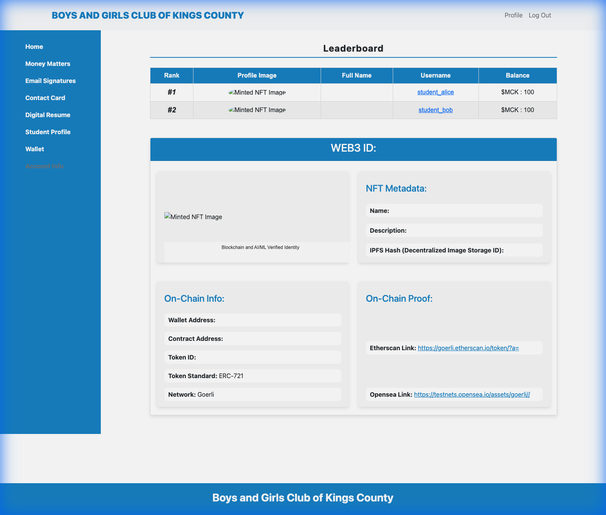

# LMeX: Learning Management Exchange 🎓🚀

> **A Next-Gen Financial Literacy Platform for Student Communities**  
> *Gamified Social Learning • Web3 Identity • Biometric Verification*

 

**LMeX** is a modernized educational platform designed to teach financial literacy through real-world "Skin in the Game." It leverages **Biometrics** for secure attendance and **Web3** for a tokenized internal economy, teaching students budgeting, saving, and debt management in real-time.

---

## Project Context

Built as technical lead for a Web3 EdTech startup's enterprise pilot program. Deployed to 150+ students across Flint, Chicago, and NYC to validate blockchain-based learning incentives.

**Status:** Archived pilot project (2022-2023). Code demonstrates production Django architecture, Web3 integration patterns, and complex feature development.

## 📸 Functional Prototype
*(Screenshots from Local Dev Environment - Dec 2025)*

| **Student Dashboard** | **Social Leaderboard** |
|:---:|:---:|
|  |  |
| *Wallet & Identity Hub* | *Gamified Token Economy* |

---

## 🛠 Modular Architecture

This project was refactored from a legacy monolith into a clean, domain-driven architecture:

- **`core/` (formerly `users`)**: 
  - Manages Custom User Models, Auth, and Wallet integration.
  - Generates verifiable "Web3 ID" Cards.
  
- **`lms/` (formerly `socialmedia`)**: 
  - The "Learning Management System" engine.
  - Handles Posts, Units, Replies, and the "Token Gating" logic (pay-to-view).
  
- **`biometrics/` (formerly `webcamrecognition`)**:
  - Handles webcam sessions and FaceID matching.
  - *Note: Runs in "Mock Mode" if `dlib` is missing.*

---

## 🚀 Quick Start (Docker)

The recommended way to run LMeX is via Docker to handle complex dependencies (`psycopg2`, `dlib`) automatically.

### 1. Clone & Configure
```bash
git clone https://github.com/your-repo/lmex.git
cd lmex
cp .env.example .env
```
*Tip: The `.env.example` comes pre-configured for local dev.*

### 2. Launch
```bash
docker-compose up --build
```
The app will launch at `http://localhost:8000`.

---

## 💻 Manual Setup (Local Dev)

If you prefer running without Docker (e.g., for rapid frontend iteration):

1. **Install Dependencies**
   ```bash
   pip install -r requirements.txt
   ```
   *Note: This installs all "Safe" dependencies. ML libraries are optional.*

2. **Run Migrations & Server**
   ```bash
   python manage.py migrate
   python manage.py runserver
   ```

3. **Mock Mode (Automatic)**
   If `face_recognition` or `Web3` libraries are missing, the app automatically enters **Mock Mode**:
   - Biometric scans simulates "Success."
   - Wallet balances show dummy ETH/Tokens.
   - *No crashes, perfect for UI development/Demoing.*

---

## 🔒 Security Highlights
- **No Private Keys:** Migration `0048` permanently removed all private key storage.
- **Environment config:** All secrets (Infura, Django Secret) are loaded from `.env`.
- **Mock Fallbacks:** Critical user paths gracefully degrade if external services are offline.

---

   ## Modernization (2025)
   
   This codebase was refactored from a pilot prototype into a production-ready application:
   
   - **Architecture:** Restructured into domain-driven modules (core, lms, biometrics)
   - **DevOps:** Dockerized for consistent deployment
   - **Developer Experience:** Mock mode enables rapid development without ML dependencies

## 📝 License
Proprietary / Portfolio Use Only.
